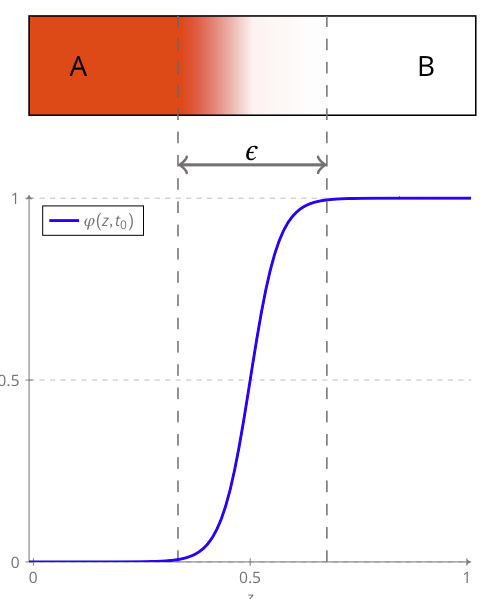
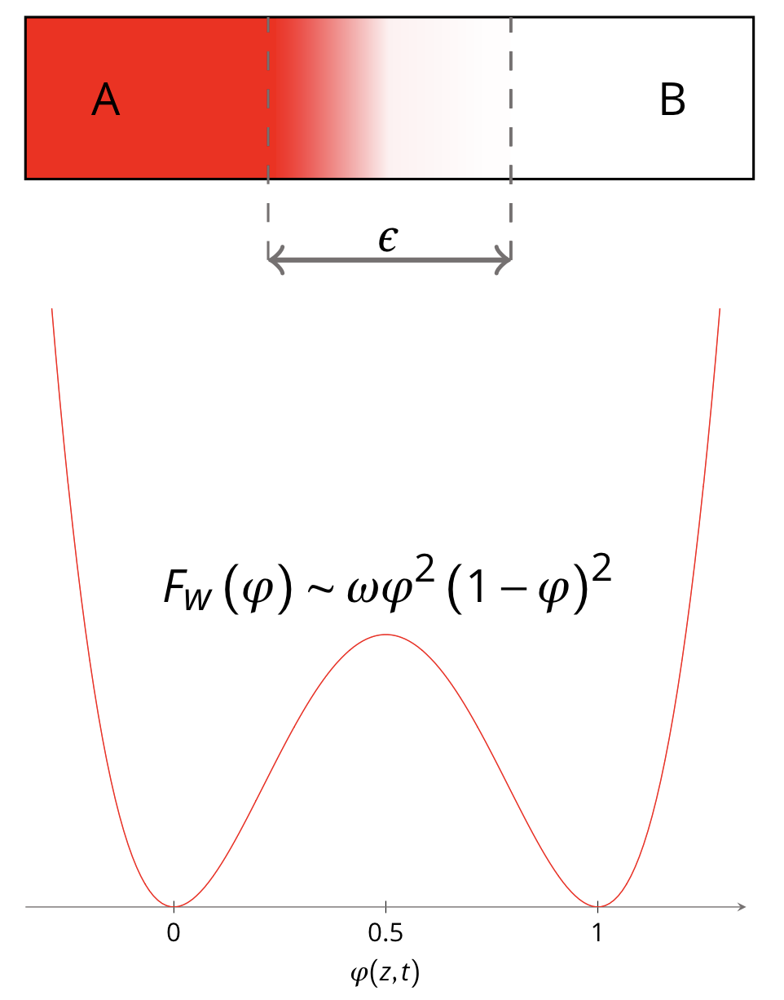

# Modelling Description

Phase-field methods are a versatile and effective approach for modeling the spatiotemporal evolution of complex physical systems involving topology changes and phase transformation. These methods have found widespread applications in materials science, including the modeling of nuclear fuel behavior.

{ width=300px, align=right }
Contrary to sharp interfaces models in which the interfaces are viewed as discontinuous surfaces with excess physical properties, phase-field modeling considers the interfaces as thin regions of finite thickness across which variables vary continuously and smoothly. With such a diffuse description of the interfaces, phase-field modeling enables an implicit tracking of the interfaces thanks to intensive phase-field variables that are constant in each bulk phase and vary smoothly across the interfaces (see, for example, the variable $`\varphi`$ in the figure).

Phase-field modeling is an interesting approach, but it is subject to constraints related to scale separation because, in practice, the physical interface thickness is much smaller than the characteristic length scale of the materials. 
Consequently, in order to make quantitative numerical simulations, an artificial thickening of the interface is introduced,  but rigorously justified with a careful parameterization of the phase-field models. 

Another advantage of phase-field models is their natural coupling with thermodynamics. The thermodynamic description of a physical system relies on classical state variables (_e.g._ temperature, pressure, volume, strain, ...), phase-field variables, and an energy functional, which can generally be written in the following form:

```math
\begin{align*}
	 \mathcal{F} &= \displaystyle\int_{\Omega} \left(F_{0} + F_{int}\right)d\Omega
\end{align*}
```

where $`F_{0}`$ is the density of energy per unit volume (_e.g._ elastic, chemical, magnetic, ...) and $`F_{int}`$ a density of energy associated with the interfaces and allowing a diffuse description of the interfaces.


{ width=300px, align=right }
For example, in the case of a two-phase system, under isothermal and isobaric conditions, the density of energy can be expressed in the following form:
```math

\begin{align*}
\mathcal{F}(\phi) &=& \displaystyle \int_{\Omega} F_w(\phi) + \dfrac{1}{2} \lambda \lVert \boldsymbol{\nabla} \phi \lVert^2 d\Omega
\end{align*}

```

where $`\lambda`$ is an energy gradient coefficient and $`F_w(\phi)=\omega \phi^2(1-\phi)^2`$ a double-well potential with $`\omega`$ the depth of the double-well. In practice, closure relations allows to formulate $`\lambda`$ and $`\omega`$ as function of the thickness of interface and the surface tension.

The governing equations associated with the evolution of a physical system can be derived from the minimization of the energy functional $`\mathcal{F}`$. In the context of the phase-field modelling, two historical phase-field models can be derived: the __Cahn-Hilliard__ model[@cahnhilliard] and the __Allen-Cahn__ model[@allencahn].

!!! equation_blue "Cahn-Hilliard- & Allen-Cahn-type models"

    === "Cahn-Hilliard"

        ```math

        \begin{align*}
        \frac{\partial \phi_i}{\partial t}&= \nabla \cdot \left[\sum_{k} M_{i,k} \nabla \frac{\delta \mathcal{F}}{\delta \phi_k}\right] \text{ in }\Omega 
        \\[6pt]    
        \sum_{i}\phi_i &=1
        \end{align*}

        ```

        where $`\phi_i`$ are phase indicators and $`M_{i,k}`$ mobility coefficients.

    === "Allen-Cahn"

        ```math

        \begin{align*} 
        \frac{\partial \phi_i}{\partial t}&= -\left[\sum_{k} L_{i,k} \nabla \frac{\delta \mathcal{F}}{\delta \phi_k}\right] \text{ in }\Omega 
        \\[6pt]    
        \sum_{i}\phi_i &=1
        \end{align*}

        ```

        where $`\phi_i`$ are phase indicators and $`L_{i,k}`$ mobility coefficients.

<!-- 
!!! equation_blue "Example of Cahn-Hilliard equations for a two-phase system"

    The Cahn-Hilliard equations for a two-phase system, under isothermal and isobaric conditions, can be expressed in the following form:

    ```math

    \begin{align*}
    \frac{\partial \phi}{\partial t}&= \nabla \cdot \left[M(\phi) \nabla \mu\right] \text{ in }\Omega 
    \\[6pt]    
    \mu &= \omega F'(\phi) - \nabla \cdot \left[\lambda \nabla \phi\right] \text{ in }\Omega 
    \end{align*}

    ```

    where $`\phi`$ is the phase indicator, $`\mu`$ the generalized chemical potential and $`F'`$ the derivative against $`\phi`$ of a potential $`F`$.


!!! equation_blue "Example of Allen-Cahn equations for a two-phase system"

    The Allen-Cahn equations for a two-phase system, under isothermal and isobaric conditions, can be expressed in the following form:

    ```math

    \begin{align*}
    \frac{\partial \phi}{\partial t}&= M(\phi) \mu  \text{ in }\Omega 
    \\[6pt]    
    \mu &=  \nabla \cdot \left[\lambda \nabla \phi\right] - \omega F'(\phi)\text{ in }\Omega 
    \end{align*}

    ```

    where $`\phi`$ is the phase indicator, $`\mu`$ the generalized chemical potential, $`F'`$ the derivative against $`\phi`$ of a potential $`F`$.  -->

Based on these two historical models, a wide range of phase-field models has been developed. `SLOTH` provides the features needed to solve both Cahn–Hilliard-type and Allen–Cahn-type models.
In addition, since it is dedicated to studying fuel behavior across different scales, from nominal operating conditions to severe accident scenarios, `SLOTH` also offers a suite of features for performing multiphysics simulations, including phase-field, thermal diffusion, multicomponent diffusion[@introini2025modeling], and CALPHAD thermodynamic calculations.

!!! equation_red "Multicomponent diffusion"

    Inter-diffusion equations in the following form can be solved by `SLOTH`. 

    ```math

    \begin{align*}
    \frac{\partial x_i}{\partial t}&= \nabla \cdot \sum_{i=1}^{n-1}\left[M_{i,n} \nabla (\mu_i-\mu_n)\right]  \text{ in }\Omega 
    \\[6pt]    
    \sum_{i=1}^{n} x_i&=1 
    \end{align*}

    ```

    where $`x_i`$ denotes the molar fraction of the component $`i`$, $`\mu_i`$ the chemical potential of the component $`i`$ and $`M_{i,n}`$ inter-diffusion mobility coefficients.

    **Fickian diffusion is also available in `SLOTH`**. 


!!! equation_green "Heat transfer"

    Heat transfer equation in the following form can be solved in `SLOTH`

    ```math

    \begin{align*}
    \rho C_p\frac{\partial T}{\partial t}&= \nabla \cdot k \nabla T + \mathcal{S} +  \mathcal{L}  \text{ in }\Omega 
    \end{align*}

    ```

    where $`\rho`$ is the molar density, $`C_p`$ the molar heat capacity, $`k`$ the thermal conductivity, $`\mathcal{S}`$ a heat generation rate, $`\mathcal{L}`$ a latent heat due to phase changes, and $`T`$ the temparature.

!!! note "CALPHAD-informed phase-field simulations"
    The CEA has developed under a proprietary license a software interface to the OpenCalphad thermodynamic solver[@sundman14] [@sundman15]. The source code is not available to unauthorized users. 
    However, the `SLOTH` development team remains available to provide first-level support to any user wishing to interface their own Gibbs Energy Minimizer (provided it is compatible with the `SLOTH` license).