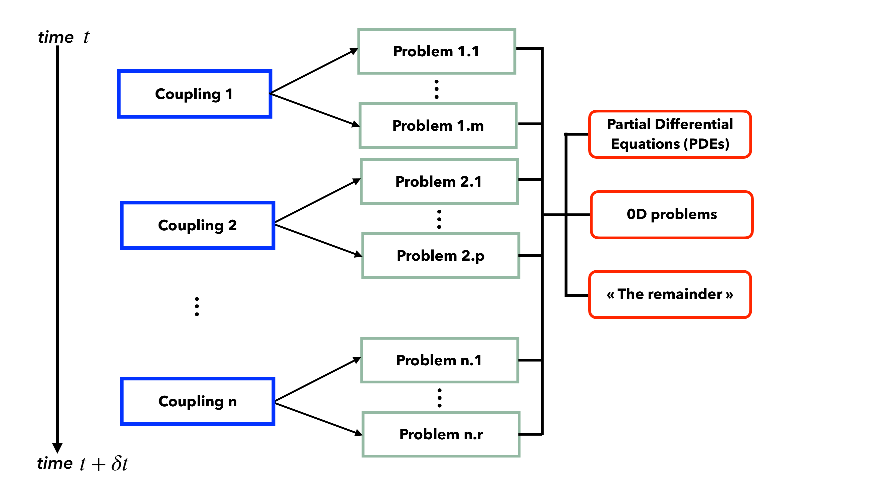

# Problems

`SLOTH` provides three main types of `Problems`: 

- [Partial Differential Equations (PDEs)](PDEs/index.md) 
- [0D problems](0D/index.md) 
- [Other types, referred to as "the remainder"](Remainder/index.md) 

<figure markdown="span">
  {  width=800px}
  <figcaption>Figure 1 : Schematic description of one time-step for `SLOTH` simulations with the three main types of `Problems`.
</figcaption>
</figure>

Each of these problems can be combined to be solved within a [`Coupling`](../Couplings/index.md) using a partitioned algorithm.