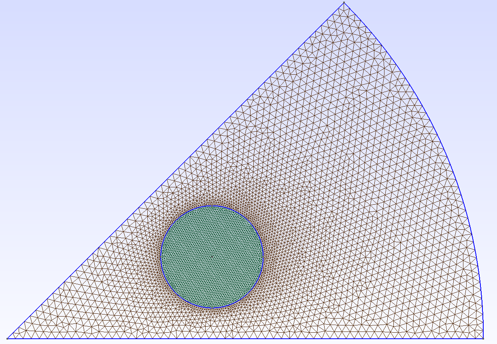
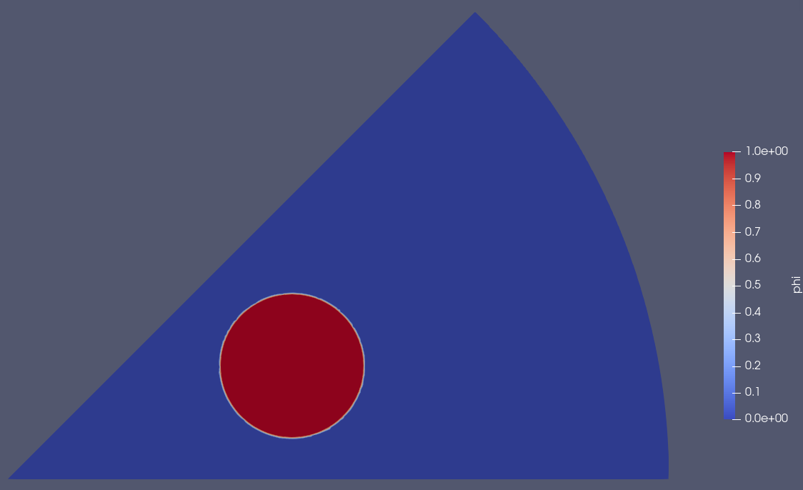

# Variables 

This page described how to define and manage variables in `SLOTH`.

Definition of variables for `SLOTH` is made with a C++ object of type `Variables` that is simply a set of C++ object of type [`Variable`](#variable).

As for the object `SpatialDiscretization` (see [Meshing](../SpatialDiscretization/Meshing/index.md)), `Variable` is a template class instantiated with two template parameters: first, the kind of finite element, and second, the spatial dimension.


The kind of finite element refers to a C++ class that inherits from the `mfem::FiniteElementCollection`. This class manages all collections of finite elements provided by `MFEM`.
Currently, the most commonly used finite element collection in `SLOTH` is `mfem::H1_FECollection`, which corresponds to arbitrary order H1-conforming continuous finite elements.

The dimension is simply an integer that can be 1, 2, or 3.

!!! example "Alias declaration for `Variable` class template"
    ```c++
    using VAR = Variable<mfem::H1_FECollection, 3>;
    ```
    This example show how to define a convenient alias for the `Variable` class template instantiated with `mfem::H1_FECollection` in dimension 3.  
    This alias is often used in tests in order to simplify the code.

## __Variable description__ {#variable}

`SLOTH` differentiates between _primary_ variables, that are solved directly by the problem (*eg.* the order parameter for the Allen-Cahn equation, the order parameter and the chemical potential for the Cahn-Hilliard equation), and _secondary_ (or _auxiliary_) variables, which are derived from another problem to ensure multiphysics coupling (*eg.* the order parameter in the heat transfer equation, the temperature in the Allen-Cahn equation). 
Both kind of variables are defined in the same way.

### __Mandatory parameters__ {#var_mandatory}

The `Variable` object must be defined by:

- the spatial discretisation (see [Meshing](../SpatialDiscretization/Meshing/index.md)), 
- a set of boundary conditions(see [BoundaryConditions](../SpatialDiscretization/BoundaryConditions/index.md)), 
- a name (C++ type `std::string`), 
- a storage depth level (C++ type `int`), 
- an initial condition.

The initial condition can be defined by a constant, a C++ object of type `std::function` or a `SLOTH` object of type `AnalyticalFunctions`. 
The latter enables to use pre-defined mathematical functions currently used in the studies conducted with `SLOTH`. If the mathematical expression is not yet available, the users can define it with a C++ object of type `std::function`.


!!! example "Example of `Variable`objects with mandatory parameters"

    The following examples assume that the spatial discretisation and the boundary conditions are defined. 
    In the code snippets, the first is referred to as a `spatial` object, while the second is referred to as a `bcs` object. Without loss of generality, the alias `VAR` is also used.

    These examples show how to initialize a variable with `double`, `AnalyticalFunctions` and `std::function` types.

    === "`double`"
        In this example, the variable is named `phi`. Its initial value is zero.

        ```c++
        int level_of_storage= 2;
        std::string variable_name = "phi";
        double initial_condition = 0.;
        auto var_1 = VAR(&spatial, bcs, variable_name, level_of_storage, initial_condition);
        ```

    === "`std::function`"

        In this example, the variable is named `T`. It is defined by a parabolic profile.

        ```c++
        int level_of_storage= 2;
        std::string variable_name = "T";

        auto initial_condition = std::function<double(const mfem::Vector&, double)>(
            [](const mfem::Vector& vcoord, double time) {
                const double Text = 800.;
                const double radius = 4.e-3;
                const double puissance = 20.e4;
                const double conductivity = 2.;
                const double r2 = radius * radius;
                double rr = std::transform_reduce(vcoord.begin(), vcoord.begin() + std::min(vcoord.Size(), 2), 0.0, std::plus<>(), [](double x) { return x * x; });

                const auto func = Text + puissance * (r2 - rr) / (4. * M_PI * 2. * r2);

                return func;
            });
        auto var_1 = VAR(&spatial, bcs, variable_name, level_of_storage, initial_condition);
        ```

    === "`AnalyticalFunctions`"

        In this example, the variable is named `phi`. It is defined by a 2D hyperbolic tangent profile.

        ```c++
        int level_of_storage= 2;
        std::string variable_name = "phi";
        const double center_x = 0.;
        const double a_x = 1.;
        const double thickness = 5.e-5;
        const double radius = 5.e-4;

        auto initial_condition = AnalyticalFunctions<2>(AnalyticalFunctionsType::HyperbolicTangent, center_x, a_x, thickness, radius)

        auto var_1 = VAR(&spatial, bcs, variable_name, level_of_storage, initial_condition);
        ```

        `SLOTH` provides several pre-implemented analytical functions, including the Heaviside function, sinusoidal profiles, hyperbolic tangent, and parabolic profiles. Each of these functions requires a set of parameters detailed in [a dedicated page of the user manual](../AnalyticalVariables/index.md).

### __Optional parameters__ {#var_option}

In addition to the [mandatory parameters](#var_mandatory), definition of `Variable` can be enhanced by an analytical solution with the same type as the initial condition. 

!!! warning "Definition of variables with an analytical solution"
    The presence of an analytical solution automatically enables the calculation of the  $`L^2`$ error over the domain. 


The initial condition can also be asscoiated with a set of attributes names that correspond to `PhysicalNames` defined in the `GMSH` file mesh. 
In this case, the list of attributes (*ie* the `PhysicalNames` defined in the `GMSH` file mesh) must be defined in a C++ container of type `std::set<std::string>`, just after the initial condition.

!!! example "Example of initialization based on `PhysicalNames` of a `GMSH` file mesh"

    Please find the following extract of a `GMSH` file mesh used to build an inclusion inside a fragment of material:
    <div style="display: flex; align-items: flex-start;">
        <div style="flex: 1; margin-right: 20px;">
            <figure markdown="span">
                { width="350" }
                <figcaption>Mesh of a fragment of material with an inclusion</figcaption>
            </figure>
        </div>
        <div style="flex: 2;">
            ```GMSH
            $MeshFormat
            2.2 0 8
            $EndMeshFormat
            $PhysicalNames
            5
            1 1 "bottom"
            1 2 "top"
            1 3 "external"
            2 22 "pellet"
            2 23 "cluster"
            $EndPhysicalNames
            ```
        </div>
    </div>
    
    In the following example, the variable named `phi` is equal to one within the inclusion associated with the attribute 'cluster' and zero elsewhere.

    ```c++
    int level_of_storage= 2;
    std::string variable_name = "phi";
    double initial_condition = 1.;
    std::set<std::string> list_of_physical_names = {"cluster"};
    auto var_1 = VAR(&spatial, bcs, variable_name, level_of_storage, initial_condition, list_of_physical_names);
    ```

    <div style="display: flex; align-items: flex-start;">
        <div style="flex: 1; margin-right: 20px;">
            <figure markdown="span">
                { width="450" }
                <figcaption>Variable initialization within a fragment of material including an inclusion</figcaption>
            </figure>
        </div>
    </div>
    

## **Additional information**

Processing certain physical problems requires additional information to distinguish variables.
This information is provided in the form of a list of strings associated with the variables using the public C++ method `set_additional_information`.

!!! example "Example of variables definition with additional information"

    The following example refers to `Calphad` problems (see [Problems](../MultiPhysicsCouplingScheme/Problems/index.md) for more details). 
    The first variable, named `Ma`, corresponds to a mobility coefficient whereas the second one is associated with a chemical potential named `mu_a`. 
    
    For a `Calphad` problem, managing the variables requires knowing the type of each variable. By convention, the last additional information corresponds to a pre-defined symbol (e.g., 'mu' for chemical potentials and 'mob' for mobilities). 
    
    The definition of chemical potentials requires the name of the chemical element, whereas for mobilities, both the name of the phase and the name of the chemical element must be specified.

    ```c++
        int level_of_storage= 2;
        std::string variable_name_1 = "Ma";
        double initial_condition_1 = 1.e-15;
        auto var_1 = VAR(&spatial, bcs, variable_name_1, level_of_storage, initial_condition_1);
        var_1.set_additional_information("SOLUTION", "A", "mob");

        std::string variable_name_2 = "mu_a";
        double initial_condition_2 = 1.e5;
        auto var_2 = VAR(&spatial, bcs, variable_name_2, level_of_storage, initial_condition_2);
        var_2.set_additional_information("A", "mu");
    ```

    Conventions used to associate additional information with variables for each kind of `SLOTH` problem are detailed in Section [Problems](../MultiPhysicsCouplingScheme/Problems/index.md)of the user manual.

<!-- ## **Use of auxiliary variables**

For `SLOTH`, auxiliary variables ensure multiphysics coupling. As   -->


## __Variables__ {#variables}

The C++ class `Variables` allows to define a collection of [`Variable` objects](#variable). 
As for the object `Variable`, `Variables` is a template class instantiated with two template parameters: first, the kind of finite element, and second, the spatial dimension.

Each `SLOTH` problem (see [Problems](../MultiPhysicsCouplingScheme/Problems/index.md) for more details) requires a `Variables` object as input argumet.


!!! example "Example of `Variables` definition"

    ```c++
        std::string variable_name_1 = "mu_a";
        double initial_condition_1 = 1.e5;
        auto var_1 = VAR(&spatial, bcs, variable_name_1, level_of_storage, initial_condition_1);
        var_1.set_additional_information("A", "mu");

        std::string variable_name_2 = "mu_a";
        double initial_condition_2 = 2.e5;
        auto var_2 = VAR(&spatial, bcs, variable_name_2, level_of_storage, initial_condition_2);
        var_2.set_additional_information("A", "mu");

        auto mu_var = VARS(var_1, var_2);
    ```

    This example shows the definition of two variables that correspond to chemical potentials. These variables are gathered within a `Variables` object that can be used as primary variables for a `CALPHAD` problem and as auxiliary variables for `ThermalDiffusion` problems.