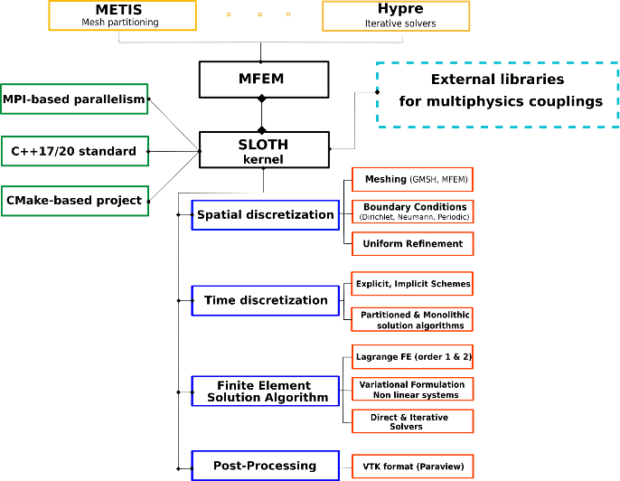

# User manual

Figure 1 shows a schematic overview of the `SLOTH` features.

<figure markdown="span">
  {  width=500px}
  <figcaption>Figure 1 : schematic overview of the `SLOTH` features
</figcaption>
</figure>

`SLOTH` is developed on top of `MFEM` [@mfem].
It is implemented in C++ and the software build process is managed with CMake. 

This page focuses on the kernel of `SLOTH`, providing all the essential information users need to construct or modify a `SLOTH` data file. This includes:

- [Variables](Variables/index.md) and [Parameters](Parameters/index.md)
- [Spatial discretisation](SpatialDiscretization/index.md), including the `SLOTH` objects [Meshing](SpatialDiscretization/Meshing/index.md) and [BoundaryConditions](SpatialDiscretization/BoundaryConditions/index.md)
- [Multiphysics coupling scheme](MultiPhysicsCouplingScheme/index.md), including the `SLOTH`objects [TimeDiscretization](MultiPhysicsCouplingScheme/Time/index.md), [Coupling](MultiPhysicsCouplingScheme/Couplings/index.md), [Problems](MultiPhysicsCouplingScheme/Problems/index.md) and [Convergence](MultiPhysicsCouplingScheme/Convergence/index.md)
- [Post-Processing](PostProcessing/index.md)

!!! tip "On the use of tutorials"
    Development team recommend visiting the [tutorials page](../../Started/HowTo/Tutorials/index.md) to discover tips and tricks for specific `SLOTH` features

!!! note "`MFEM` documentation"
    For further details regarding dependencies, advanced numerical methods, and massively parallel features, users are referred to the [MFEM website](https://mfem.org).

!!! note "Installation guide"
    In addition, users are referred to the [`Getting started`](../../Started/index.md) page for more details about the installation and compilation of `SLOTH`. 

