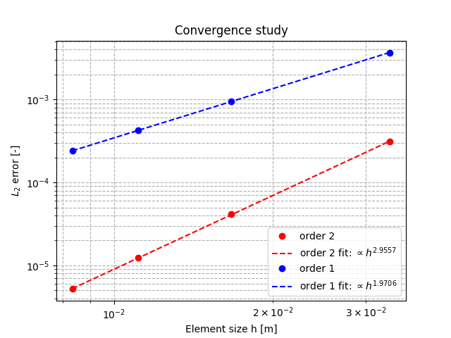

# **Example 1: steady-state solution of the Allen-Cahn equations**

### __Files__ 

- Comprehensive test file: [main.cpp](https://github.com/Collab4Sloth/SLOTH/tree/master/tests/AllenCahn/2D/test1/main.cpp)
- Reference results for comparison: [convergence_output_ref.csv](https://github.com/Collab4Sloth/SLOTH/tree/master/tests/AllenCahn/2D/test1/ref/convergence_output_ref.csv)


### __Statement of the problem__ 

This test consists of finding the steady-state solution of the Allen-Cahn equations. A transient simulation is performed to reach this steady-state, and a convergence analysis is carried out to ensure the consistency of the results.


The domain $`\Omega`$ is a square $`[0,1]\times[0,1]`$

```math

\begin{align}
\frac{\partial \phi}{\partial t}&=-M (F'(\phi) - \lambda \Delta \phi) \text{ in }\Omega 
\end{align}

```

where $`\phi`$ is the phase indicator, $`F'`$ the derivative against $`\phi`$ of the potential $`F`$ defined by:

```math

\begin{align} 
F(\phi)&=\omega\phi^2(1-\phi)^2
\end{align}

```


### __Initial condition__

The initial condition is given by:

```math

    \phi =  \dfrac{1}{2} + \dfrac{1}{2} \tanh\left(\dfrac{x-0.5}{5\cdot 10^{-3}}\right).

```


### **Parameters used for the test**
    
For this test, all parameters are equal to one. 

| Name              | Description                        | Symbol       | Value                         |
| -----   | ---------------------------------- | ------------ | ----------------------------- |
| `mob` | mobility coefficient               | $`M_\phi`$   | $`1.0`$                     |
    | `lambda` | energy gradient coefficient        | $`\lambda`$  | $`\dfrac{3}{2}{\sigma}{\epsilon}`$ |
    | `omega` | depth of the double-well potential | $`\omega`$   | $`12\dfrac{\sigma}{\epsilon}`$  |
    | `sigma` | surface tension| $`\sigma`$   | $`1.0`$     |
    | `epsilon` | thickness of interface | $`\epsilon`$   | $`0.1`$     |

### __Boundary conditions__

Neumann and Dirichlet boundary conditions are prescribed on boundary of the domain:

```math

\begin{align} 
{\bf{n}} \cdot{} \lambda \nabla \phi&=0 \text{ on }\partial\Omega_{top}\cap\partial\Omega_{bottom}

\\[6pt]

\phi&=1 \text{ on }\partial\Omega_{right}
\\[6pt]

\phi&=0 \text{ on }\partial\Omega_{left}
\end{align}
```


### __Numerical scheme__

- Time integration: Euler Implicit over the interval $`t\in[0,1]`$ with a time-step $`\delta t=10^{-3}`$. The calculation stops when convergence criteria are reached.

```math

\|{\phi(t+\delta t)-\phi(t)}\|<\epsilon_\phi


```

where  $`\epsilon_\phi=10^{-12}`$. 

- Spatial discretization for convergence analysis: uniform grid with $`N={30, 60, 90, 120}`$ nodes in each spatial direction, with $`\mathcal{Q}_1`$ and $`\mathcal{Q}_2`$ finite elements
- Newton solver: relative tolerance $`10^{-12}`$, absolute tolerance $`10^{-12}`$
- Iterative solver: HYPRE_GMRES 
- Preconditioner: HYPRE_ILU


### __Results__ 

The steady state solution is given by:

```math

    \phi =  \dfrac{1}{2} + \dfrac{1}{2} \tanh\left(\dfrac{x-0.5}{\epsilon}\right).

```

Figures 1 shows the results of convergence analysis with $`\mathcal{Q}_1`$ and $`\mathcal{Q}_2`$.

<figure markdown="span">
    {  width=500px}
    <figcaption>Figure 1: convergence analysis with $`\mathcal{Q}_1`$ and $`\mathcal{Q}_2`$ finite elements
    </figcaption>
</figure>
