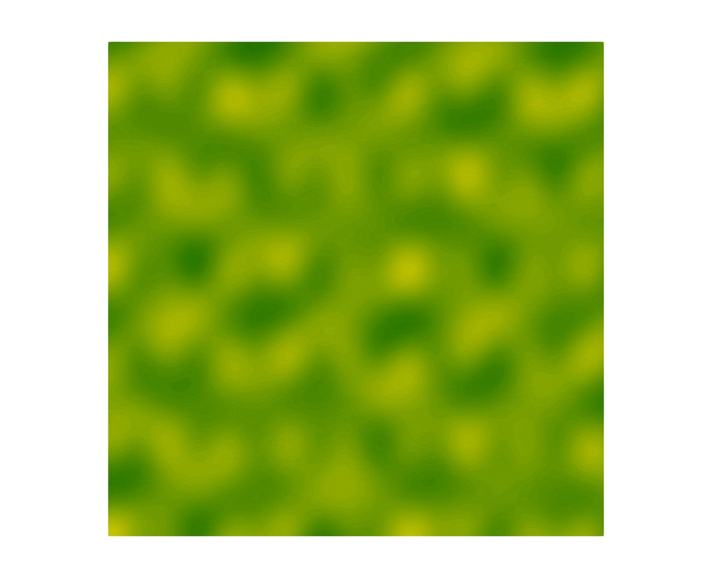
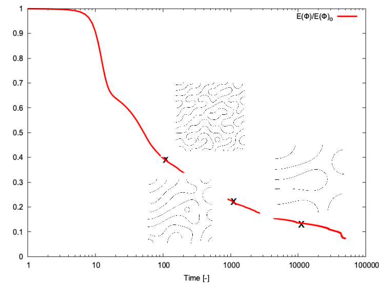

# **Example 3: spinodal decomposition**


### __Files__ 

- Comprehensive test file: [main.cpp](https://github.com/Collab4Sloth/SLOTH/tree/master/tests/CahnHilliard/2D/test2/main.cpp)
- Reference results for comparison: [time_specialized.csv](https://github.com/Collab4Sloth/SLOTH/tree/master/tests/CahnHilliard/2D/test2/ref/time_specialized.csv)


### __Statement of the problem__ 

This test corresponds to the 2D simulation of spinodal decomposition proposed on [PFhub](https://pages.nist.gov/pfhub/benchmarks/benchmark1.ipynb/)

The domain $`\Omega`$ is a square $`[0,200]\times[0,200]`$

```math

\begin{align}
\frac{\partial \phi}{\partial t}&= M\Delta \mu \text{ in }\Omega 
\\[6pt]    
\mu &= F'(\phi) - \lambda \Delta \phi \text{ in }\Omega 
\end{align}

```

where $`\phi`$ is the phase indicator, $`\mu`$ the generalized chemical potential and $`F'`$ the derivative against $`\phi`$ of the potential $`F`$ defined by:

```math

\begin{align} 
F(\phi)&=\omega(\phi - 0.3)^2 (0.7 - \phi)^2.
\end{align}

```

### __Initial condition__

The initial condition is defined by:

```math

    \phi = 0.5 + 0.01  \left[\cos(0.105x)\cos(0.11y) +(\cos(0.13x)\cos(0.087y))^2+ \cos(0.025x - 0.15y)\cos(0.07x - 0.02y)\right]

```

<figure markdown="span">
    {  width=400px}
    <figcaption>Figure 1: initial state 
    </figcaption>
</figure>

### **Parameters used for the test**
    
For this test, the following parameters are considered:

| Name              | Description                        | Symbol       | Value                         |
| -----   | ---------------------------------- | ------------ | ----------------------------- |
| `mob` | mobility coefficient               | $`M_\phi`$   | $`5.0`$                     |
    | `lambda` | energy gradient coefficient        | $`\lambda`$  | $`2.0`$ |
    | `omega` | depth of the double-well potential | $`\omega`$   | $`5.0`$     |

### __Boundary conditions__

Neumann boundary conditions are prescribed on the boundary of the domain:

```math

\begin{align} 
{\bf{n}} \cdot{} \lambda \nabla \phi&=0 \text{ on }\partial\Omega

\\[6pt]

{\bf{n}} \cdot{} \lambda \nabla \mu&=0 \text{ on }\partial\Omega
\end{align}
```

### __Numerical scheme__

- Time integration: Euler Implicit over the interval $`t\in[0,10]`$ (it could be extended further) with a time-step $`\delta t=1`$
- Spatial discretization: uniform grid with $`N=100`$ nodes in each spatial direction
- Newton solver: relative tolerance $`10^{-12}`$, absolute tolerance $`10^{-12}`$
- Iterative solver: HYPRE_GMRES 
- Preconditioner: HYPRE_ILU


### __Results__ 

The average value of $`\phi`$ is an available ouput of the simulation (see the file `time_specialized.csv`). It is defined by:

```math

\dfrac{1}{|\Omega|}\displaystyle\int_{\Omega} \phi dv 

```

For this test, the computed average value should remain constant over time.

The figure 2 shows the spinodal decomposition, with a final simulation time set to $`10000`$. 

<figure markdown="span">
    {  width=400px}
    <figcaption>Figure 2 : spinodal decomposition
    </figcaption>
</figure>

Figure 3 shows the time evolution of the normalized free-energy density, with snapshots taken at $`100`$, $`1000`$ and $`10000`$ s.

<figure markdown="span">
    {  width=400px}
    <figcaption>Figure 3 : time evolution of the normalized density of free energy
    </figcaption>
</figure>
