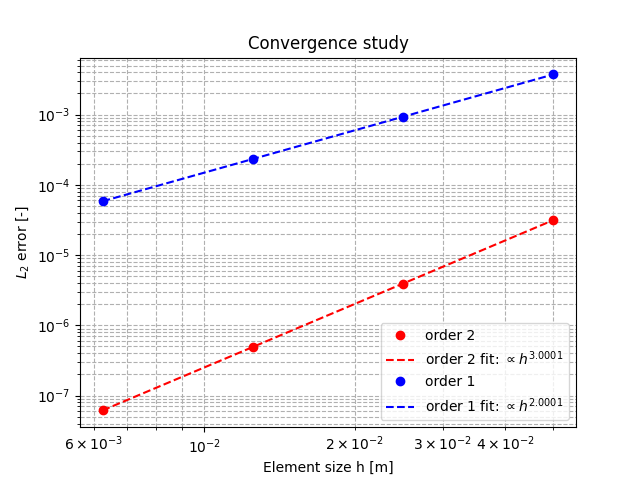

# **Example 5: MMS benchmark**

### __Files__ 

- Comprehensive test file: [main.cpp](https://github.com/Collab4Sloth/SLOTH/tree/master/tests/CahnHilliard/2D/test5/main.cpp)
- Reference results for comparison: [convergence_output_ref.csv](https://github.com/Collab4Sloth/SLOTH/tree/master/tests/CahnHilliard/2D/test5/ref/convergence_output_ref.csv)

### __Statement of the problem__ 

This test is taken from Zhang & al.[@zhang2013quantitative]. 
It consists of spatial convergence analysis based on a manufactured solution benchmark.

The domain $`\Omega`$ is a square $`[0,1]\times[0,1]`$

```math

\begin{align}
\frac{\partial \phi}{\partial t}&= \Delta \mu +S(x,y,t)\text{ in }\Omega 
\\[6pt]    
\mu &= F'(\phi) - \lambda \Delta \phi \text{ in }\Omega 
\end{align}

```

where $`\phi`$ is the phase indicator, $`\mu`$ the generalized chemical potential and $`F'`$ the derivative against $`\phi`$ of the potential $`F`$ defined by:

```math

\begin{align} 
F(\phi)&=\frac{\phi^4}{4} - \frac{\phi^2}{2}
\end{align}

```

In equation (1), $`S(x,y,t)`$ is the source term allowing the exact solution:

```math

 \phi = (t+1) \sin(\alpha \pi x)

```

### __Initial condition__

The initial condition is given by:

```math

    \phi =  \sin(\alpha \pi x)

```
For this test, $`\alpha`$ is set to $`1`$.


### **Parameters used for the test**
    
For this test, all parameters are equal to one. 

| Name              | Description                        | Symbol       | Value                         |
| -----   | ---------------------------------- | ------------ | ----------------------------- |
| `mob` | mobility coefficient               | $`M_\phi`$   | $`1.0`$                     |
    | `lambda` | energy gradient coefficient        | $`\lambda`$  | $`1.0`$ |
    | `omega` | depth of the double-well potential | $`\omega`$   | $`1.0`$     |

### __Boundary conditions__

Neumann boundary conditions are prescribed on the top and bottom of the domain:

```math

\begin{align} 
{\bf{n}} \cdot{} \lambda \nabla \phi&=0 \text{ on }\partial\Omega_{top}\cup\partial\Omega_{bottom}

\\[6pt]

{\bf{n}} \cdot{} \lambda \nabla \mu&=0 \text{ on }\partial\Omega_{top}\cup\partial\Omega_{bottom}
\end{align}
```

Dirichlet boundary conditions are prescribed on the right and left of the domain:

```math

\begin{align} 
\phi&=0 \text{ on }\partial\Omega_{left}\cup\partial\Omega_{right}

\\[6pt]

\mu&=0 \text{ on }\partial\Omega_{left}\cup\partial\Omega_{right}
\end{align}
```

### __Numerical scheme__

- Time integration: Euler Implicit over the interval $`t\in[0,1]`$ with a time-step $`\delta t=1`$. 
- Spatial discretization for convergence analysis: uniform grid with $`N={160, 80, 40, 20}`$ nodes in each spatial direction, with $`\mathcal{Q}_1`$ and $`\mathcal{Q}_2`$ finite elements
- Newton solver: relative tolerance $`10^{-8}`$, absolute tolerance $`10^{-12}`$
- Iterative solver: HYPRE_GMRES 
- Preconditioner: HYPRE_ILU


### __Results__ 

Figures 1 shows the results of convergence analysis with $`\mathcal{Q}_1`$ and $`\mathcal{Q}_2`$.

<figure markdown="span">
    {  width=500px}
    <figcaption>Figure 1: convergence analysis with $`\mathcal{Q}_1`$ and $`\mathcal{Q}_2`$ finite elements
    </figcaption>
</figure>

