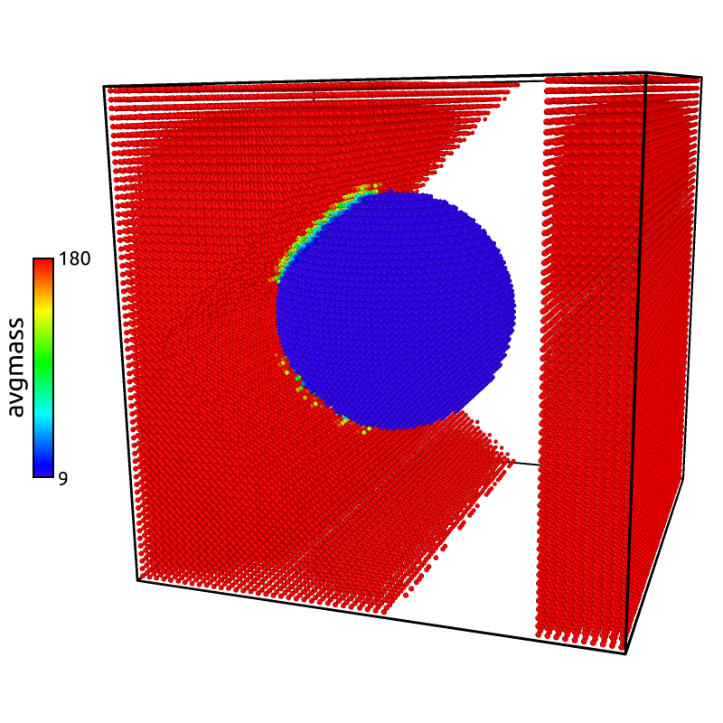

---
icon: octicons/versions-16
---  

# Code evolution

## Versioning

`exaStamp` releases can be directly accessed through the following **Releases** page as `.zip` or `.tar.gz` compressed files.

<div class="grid cards" markdown>

- [:fontawesome-brands-github: exaStamp Releases](https://github.com/Collab4exaNBody/exaStamp/releases)

</div>

<hr>

## **Compatibility with onika & exaNBody**

Please note that each version of **exaStamp** is compatible with a stable version of **onika** and **exaNBody**. Below are listed the correspondences. Any build or installation that do not respect these guidelines might lead to errors. If you want us to be able to provide the appropriate support, please follow the indications below.

| exaStamp | exaNBody | onika  |
|:--------:|:--------:|:------:|
| main     | main     | main   |
| v3.7.4   | v2.0.7   | v1.0.5 |
| v3.7.3   | v2.0.6   | v1.0.4 |
| v3.7.2   | v2.0.5   | v1.0.4 |
| v3.7.0   | v2.0.0   | v1.0.0 |

<hr>

## **Release 3.7.4**

### EAM/alloy generation python script

**Related PR:**
 
Python script to tabulate eam/alloy potentials by @lafourcadep in https://github.com/Collab4exaNBody/exaStamp/pull/49

**Description**

Python scripts that allow to transform analytical expressions of EAM potentals into EAM/alloy **DYNAMO setfl** tabulated file format have been added to **scripts/python/pytab-eam-alloy** folder. The available script concer the Sutton-Chen and Vniitf potentials for single species. Different forms can be easily added to that folder depending on the application.

**Usage**
```{bash }
cd exaStamp/scripts/python/pytab-eam-alloy
python pytab-eam-alloy-sutton-chen.py
python pytab-eam-alloy-vniitf.py
```

[Full Changelog](https://github.com/Collab4exaNBody/exaStamp/compare/v3.7.3...v3.7.4)

<hr>

## **Release 3.7.3**

### **Deterministic capabilities for testing and CI**

**Related PR:**

* Operators with deterministic random capabilities by @lafourcadep in https://github.com/Collab4exaNBody/exaStamp/pull/48

**Description:** 

If activated, all operators that use random generators are made deterministic i.e. the results is the same if launched using any combination of MPI processes or OMP threads.

**Usage example:**

```yaml
+compute_force:
    - langevin_thermostat: { T: 300. K, gamma: 0.1 ps^-1}

global:
  simulation_end_iteration: 20
  simulation_log_frequency: 50
  simulation_dump_thermo_frequency: -1
  simulation_dump_frequency: -1
  deterministic_noise: true
```

### Small changes

**File lencensing for open source release**

* 33 file licensing by @lafourcadep in https://github.com/Collab4exaNBody/exaStamp/pull/37

**Remove contribs/taz and place it in a separate repository

* remove taz by @rprat-pro in https://github.com/Collab4exaNBody/exaStamp/pull/43

**Cleanup contribs folder and reorganize folders/files in exaStamp

* 42 cleanup contribs folder by @lafourcadep in https://github.com/Collab4exaNBody/exaStamp/pull/44

[Full Changelog](https://github.com/Collab4exaNBody/exaStamp/compare/v3.7.2...v3.7.3)

<hr>

## Release 3.7.2

### **Small changes**

* Use the release mode as default build type mode
* add CONTRIBUTING.md + update guidelines in README.md 
* add SUPPORT.md
* supressed paraview and xyz specific writers as they're obsolete. These operators are now defined in exaNBody directly

### **EAM potentials**

EAM potentials now use exaNBody's generalized attributes for the local electronic density and embedding functions used in EAM potentials. This now allows to visualize the local electronic density as a per-atom field in OVITO or ParaView for example.  

Usage example (if an EAM potential is used!) :

```yaml
write_xyz:
  fields: [ rho_dEmb ]
```

<figure markdown="span">
  { width="300" }
  <figcaption>Image caption</figcaption>
</figure>
  
### **Spatial average**

Thanks to new functionalities added in exaNBody@v2.0.5, a spatial averaging function is now available in exaStamp. 

Usage example: 

```yaml
average_neighbors_scalar:
  nbh_field: mass
  avg_field: avgmass
  rcut: 8.0 ang
  weight_function: [ 1.0, 0.0, 0.0, 0.0 ]

write_xyz:
  fields: [ mass, avgmass ]
  filename: "test_avg.xyz"
```

Figure generated using ovito from test_avg.xyz file:

<figure markdown="span">
  { width="300" }
  <figcaption>Image caption</figcaption>
</figure>

[Full Changelog](https://github.com/Collab4exaNBody/exaStamp/compare/release-v3.7.0...v3.7.2)

<hr>
