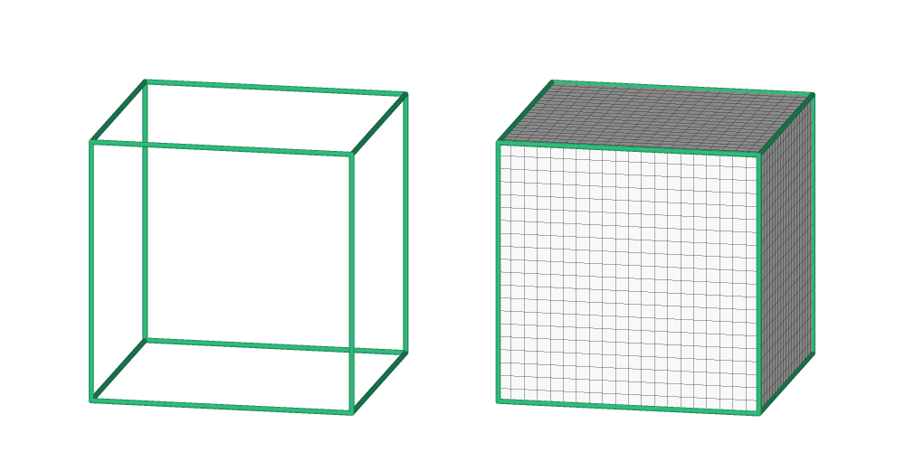
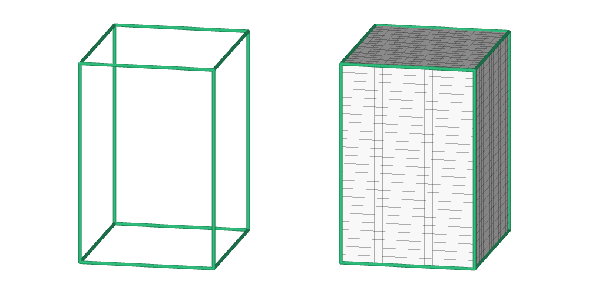
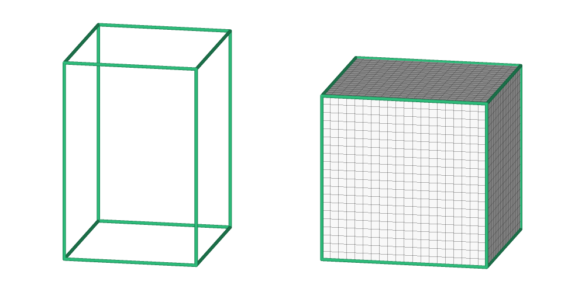
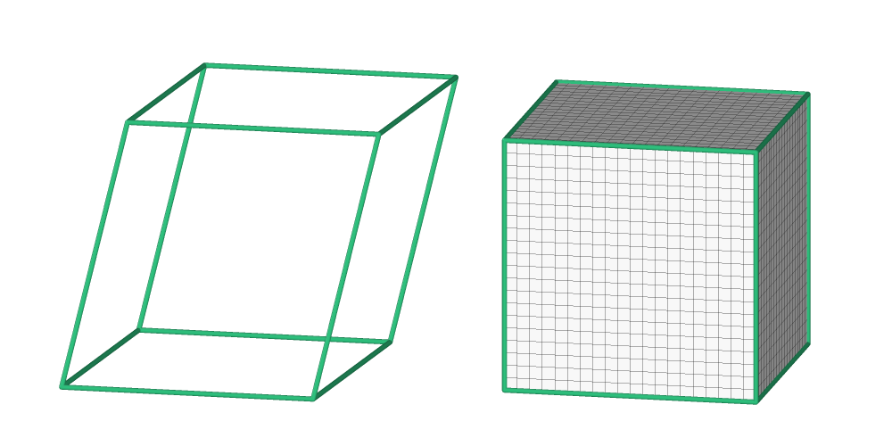
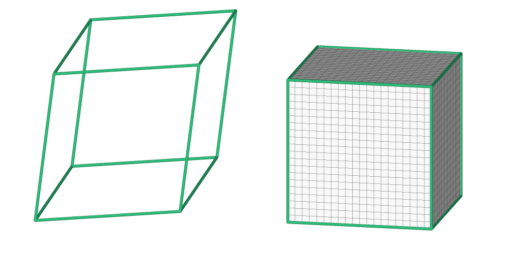

# **Simulation Domain**

## **Physical space vs Grid space**

`exaStamp` does all of its parallelization work in a **Grid space**: an integer grid of cubic cells that approximates your (possibly triclinic) **physical space** simulation box. The `domain` operator below defines both at once, from a physical `bounds`/`xform` and a grid `cell_size`/`grid_dims` — the two must be consistent with each other (see the warning further down). The full derivation of the transform between the two spaces is optional reading, kept here for reference.

??? note "Full derivation of the physical space ↔ grid space transform"

    The 3D simulation box can be represented by its **3x3** frame matrix $\mathbf{H_P}$ (with the subscript $(\cdot)_P$ for physical space) built on the 3 periodicity vectors $\mathbf{a}$, $\mathbf{b}$ and $\mathbf{c}$:

    $$
    \mathbf{H_P} = \begin{pmatrix} \mathbf{a} | \mathbf{b} | \mathbf{c} \end{pmatrix} = \begin{pmatrix} a_x & b_x & c_x \\ a_y & b_y & c_y \\ a_z & b_z & c_z\end{pmatrix}
    $$

    without any constraints on the periodicity vectors $\mathbf{a}$, $\mathbf{b}$ and $\mathbf{c}$ w.r.t the orthonormal frame. From this, we assume that the $\mathbf{H_P}$ matrix can be decomposed as:

    $$
    \mathbf{H_P} = \mathbf{F_1} \cdot \mathbf{D} = \mathbf{F_1} \cdot \begin{pmatrix} || \mathbf{a} || & 0 & 0 \\ 0 & || \mathbf{b} || & 0 \\ 0 & 0 & || \mathbf{c} || \end{pmatrix}
    $$

    where $\mathbf{D}$ is a diagonal matrix with components equal to the norm of each periodicity vector and $\mathbf{F_1}$ a transformation matrix that allows to transform the general (triclinic) physical domain to a pure orthorhombic unphysical one. $\mathbf{F_1}$ can be trivially calculated as:

    $$
    \mathbf{F_1} = \mathbf{H_P} \cdot \mathbf{D}^{-1} = \mathbf{H_P} \cdot \begin{pmatrix} \frac{1}{ || \mathbf{a} || } & 0 & 0 \\ 0 & \frac{1}{|| \mathbf{b} ||} & 0 \\ 0 & 0 & \frac{1}{ || \mathbf{c} || } \end{pmatrix}
    $$

    In the Grid space, the domain needs to be defined through a diagonal matrix $\mathbf{H_G}$ (with the subscript $(\cdot)_G$ for grid space) where each diagonal component equals an integer multiple $(n_x, n_y, n_z)$ of the cell_size $c_s$:

    $$
    \mathbf{H_G} = \begin{pmatrix} n_x \cdot c_s & 0 & 0 \\ 0 & n_y \cdot c_s & 0 \\ 0 & 0 & n_z \cdot c_s \end{pmatrix}
    $$

    Finally, both physical space and grid space meet through the following equality:

    $$
    \mathbf{H_G} = \mathbf{X_f} \cdot \mathbf{H_P}
    $$

    which adds an additional constraint on the compatibility between the physical space and grid space. Indeed, for the compatibility to be satisfied, the diagonal matrix $mathbf{D}$ is mapped to the $\mathbf{H_G}$ matrix through the following operation:

    $$
    \mathbf{D} = \mathbf{F_2} \cdot \mathbf{H_G}
    $$

    leading to:

    $$
    \mathbf{F_2} = \mathbf{D} \cdot \mathbf{H_G}^{-1} = \begin{pmatrix} \frac{||\mathbf{a}||}{n_x \cdot c_s} & 0 & 0 \\ 0 & \frac{||\mathbf{b}||}{n_y \cdot c_s} & 0 \\ 0 & 0 & \frac{||\mathbf{c}||}{n_z \cdot c_s} \end{pmatrix}
    $$

    where $(n_x,n_y,n_z)$ and $c_s$ are fixed by the user as explained hereafter. If the user requires a specific cell size $c_s$, then the number of cells and the appropriate $\mathbf{X_f}$ are automatically calculated and vice versa. The final expression of the $\mathbf{X_f}$ reads:

    $$
    \mathbf{X_f} = \mathbf{F_1} \cdot \mathbf{F_2} = \mathbf{H_P} \cdot \mathbf{D}^{-1} \cdot \mathbf{D} \cdot \mathbf{H_G}^{-1}
    $$

    which simplifies to:

    $$
    \mathbf{X_f} = \mathbf{H_P} \cdot \mathbf{H_G}^{-1} = \begin{pmatrix} \mathbf{a} | \mathbf{b} | \mathbf{c} \end{pmatrix} = \begin{pmatrix} a_x & b_x & c_x \\ a_y & b_y & c_y \\ a_z & b_z & c_z\end{pmatrix} \cdot \begin{pmatrix} n_x \cdot c_s & 0 & 0 \\ 0 & n_y \cdot c_s & 0 \\ 0 & 0 & n_z \cdot c_s \end{pmatrix}^{-1}
    $$

    which can lead to very simple expression of $\mathbf{X_f}$ when for example the physical domain is a cubic domain with lengths exactly set to a multiple of cell size.

## **Defining the domain**

### The `domain` operator

The `domain` operator allows to fully define the simulation domain as follows:

```yaml
domain:
  cell_size: 5.0 ang
  grid_dims: [20,20,20]
  bounds: [[0 ang ,0 ang,0 ang],[100 ang, 100 ang, 100 ang]]
  xform: [[1.,0.,0.],[0.,1.,0.],[0.,0.,1.]]
  periodic: [true,true,true]
  mirror: []
  expandable: false
```

where all properties of the `domain` block are described below.

??? note "`domain` block properties"

    | Property | Description | Data Type | Default |
    |---|---|---|---|
    | `cell_size` | Grid cell size, in grid space. | float (physical quantity) | `0.` |
    | `grid_dims` | 3D grid dimensions, in number of cells. | IJK (3 ints) | `[0,0,0]` |
    | `bounds` | Domain bounds, in grid space. | AABB (2 x Vec3d) | `[[0,0,0], [0,0,0]]` |
    | `xform` | Grid space to real space transformation matrix. | Mat3d | `[[1,0,0],[0,1,0],[0,0,1]]` |
    | `periodic` | Per-axis (x, y, z) periodic boundary conditions. | 3 booleans | `[false, false, false]` |
    | `mirror` | Mirrored faces. Each entry is one of `x`, `x-`, `x+`, `y`, `y-`, `y+`, `z`, `z-`, `z+` — a bare axis letter mirrors both faces of that axis, a signed one mirrors only that face. Setting a face's mirror disables periodicity on that axis (and vice versa). | sequence of strings | `[]` |
    | `expandable` | Whether the domain is allowed to grow to accommodate particles created or read outside its initial bounds. | bool | `true` |

!!! warning

    When defining the simulation domain through this operator, all properties must be consistent with each other. In particular, `cell_size` multiplied by `grid_dims` must be equal to max(`bounds`) - min(`bounds`).

### Usage examples

Multiple examples of domain definitions are provided below with, for each case, an example of the `domain` YAML block, a visualization of the physical space and another visualization of the grid space.

#### Cubic domain

The first example creates a cubic physical domain with 100 $\AA$ side length, with 20 cells in each direction. In grid space, the domain also is cubic with the same dimensions.

```yaml
domain:
  cell_size: 5.0 ang
  grid_dims: [20,20,20]
  bounds: [[0 ang ,0 ang,0 ang],[100 ang, 100 ang, 100 ang]]
  xform: [[1.,0.,0.],[0.,1.,0.],[0.,0.,1.]]
  periodic: [true,true,true]
  expandable: false
```

In that case, the $\mathbf{X_f}$ matrix equal the identity matrix and the grid space domain is exactly equal to the physical space domain. Below are displayed the 3D physical (left) and grid (right) domains look like:

<figure markdown="span">
  { width="600" }
</figure>

#### Orthorhombic domain

In that second example, an orthorhombic physical domain with 80 $\AA$, 100 $\AA$ and 120 $\AA$ side lengths is created, with 16, 20 and 25 cells in each direction. In grid space, the domain is also orthorhombic with the same dimensions since the physical size exactly equals a finite number of cells in each direction.

```yaml
# 1st solution
domain:
  cell_size: 5.0 ang
  grid_dims: [16,20,24]
  bounds: [[0 ang ,0 ang,0 ang],[80 ang, 100 ang, 120 ang]]
  xform: [[1.,0.,0.],[0.,1.,0.],[0.,0.,1.]]
  periodic: [true,true,true]
  expandable: false
```

As before, since the physical domain exactly equals (in each direction), a finite number of cells, the grid domain has the exact same dimensions.

<figure markdown="span">
  { width="600" }
</figure>

If for some reasons the user needs to have the same grid dimensions in each direction, it is possible to define an orthorhombic physical domain by modifying the $\mathbf{X_f}$ matrix as follows:

```yaml
# 2nd solution
domain:
  cell_size: 5.0 ang
  grid_dims: [20,20,20]
  bounds: [[0 ang ,0 ang,0 ang],[100 ang, 100 ang, 100 ang]]
  xform: [[0.8,0.,0.],[0.,1.,0.],[0.,0.,1.2]]
  periodic: [true,true,true]
  expandable: false
```

This way, the physical domain has the exact same dimensions as before, but the grid domain is now cubic with 20 cells in each direction.

<figure markdown="span">
  { width="600" }
</figure>

#### Restricted triclinic domain

```yaml
# 1st solution: restricted triclinic
# (e.g. **a** is parallel to x and
# **b** is in the (x,y) plane)
domain:
  cell_size: 5.0 ang
  grid_dims: [20,20,20]
  bounds: [[0 ang ,0 ang,0 ang],[100 ang, 100 ang, 100 ang]]
  xform: [[1.,0.1,0.2],[0.,1.,0.2],[0.,0.,1.]]
  periodic: [true,true,true]
  expandable: false
```

<figure markdown="span">
  { width="600" }
</figure>

#### Generalized triclinic domain

```yaml
# 2nd solution: general triclinic
# (e.g. no constraints on **a** or **b**)
domain:
  cell_size: 5.0 ang
  grid_dims: [20,20,20]
  bounds: [[0 ang ,0 ang,0 ang],[100 ang, 100 ang, 100 ang]]
  xform: [[1.,0.05,0.1],[0.05,1.,0.1],[0.1,0.1,1.2]]
  periodic: [true,true,true]
  expandable: false
```

<figure markdown="span">
  { width="600" }
</figure>

## **Alternative ways for defining the domain**

In some cases, the simulation domain does not need to be fully defined through the `domain` operator above. The domain information can instead be derived from a particle-generation operator, or already be contained in an external file.

### Built-in particles creators

- `lattice`: Replicates a unit cell (SC, BCC, FCC, HCP, …) into a **pre-existing, fully-defined** `domain`. Unlike `bulk_lattice` below, it does not derive or resize the domain itself.

    !!! warning

        `lattice` requires `domain` to be fully defined *and* `init_rcb_grid` to be called in between `domain` and `lattice`, so the grid is already partitioned across MPI ranks before particles are generated into it:

        ```yaml
        input_data:
          - domain: { ... }
          - init_rcb_grid
          - lattice: { ... }
        ```

- `bulk_lattice`: The system shape and size is created according to the replication in the 3D space of a unit cell chosen by the user, from which a matching `domain` is derived (`grid_dims`, `xform`, `bounds` are computed from the lattice and the repeat count). It performs its own grid partitioning internally, so it does **not** need a separate `init_rcb_grid` step.

See [Particles Features → Input](../F_Particles/input.md) for the full set of built-in particle generators.

### External file readers

- `read_xyz_file_with_xform`: Instead of creating the system from a template, an external `.xyz` file is read in which the number of atoms, their positions and the simulation cell size and shape are provided. In that case, only the `cell_size` property of the `domain` YAML block is needed.
- `read_dump_atoms`: The simulation starts at a specific timestep for which a restart file was generated. That restart file usually contains all information for the simulation domain.
- `read_dump_molecule`: Same as above but for flexible molecules.
- `read_dump_rigidmol`: Same as above but for rigid molecules.

See [Particles Features → Input](../F_Particles/input.md) for the full parameter reference of these readers.
