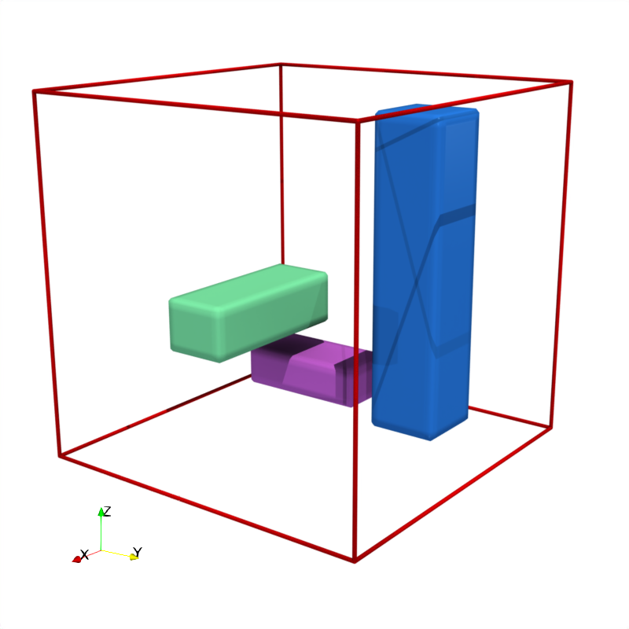
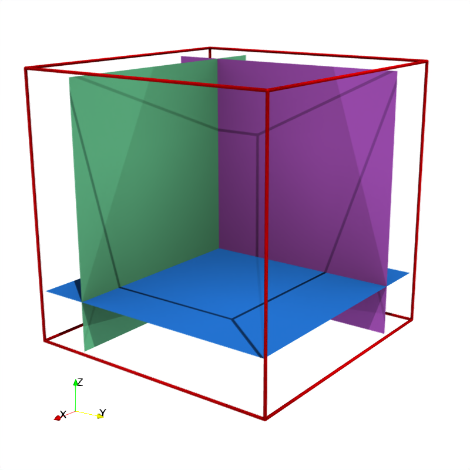
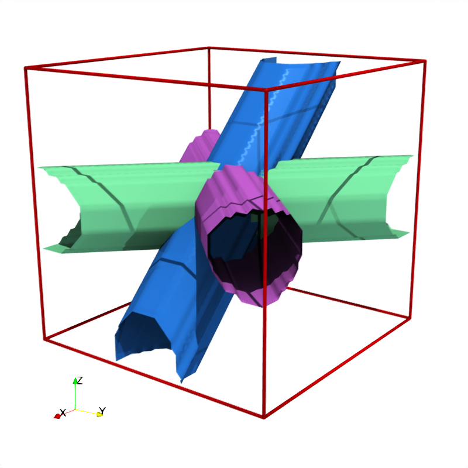
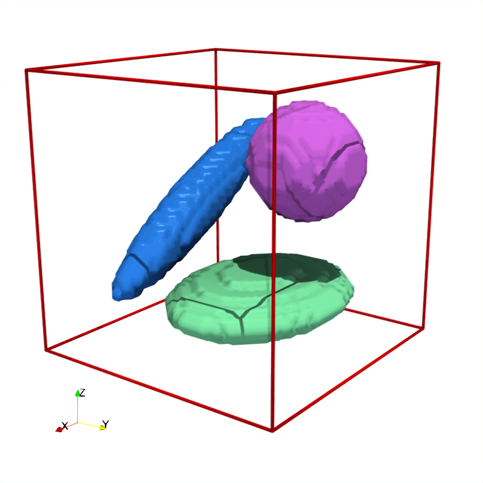
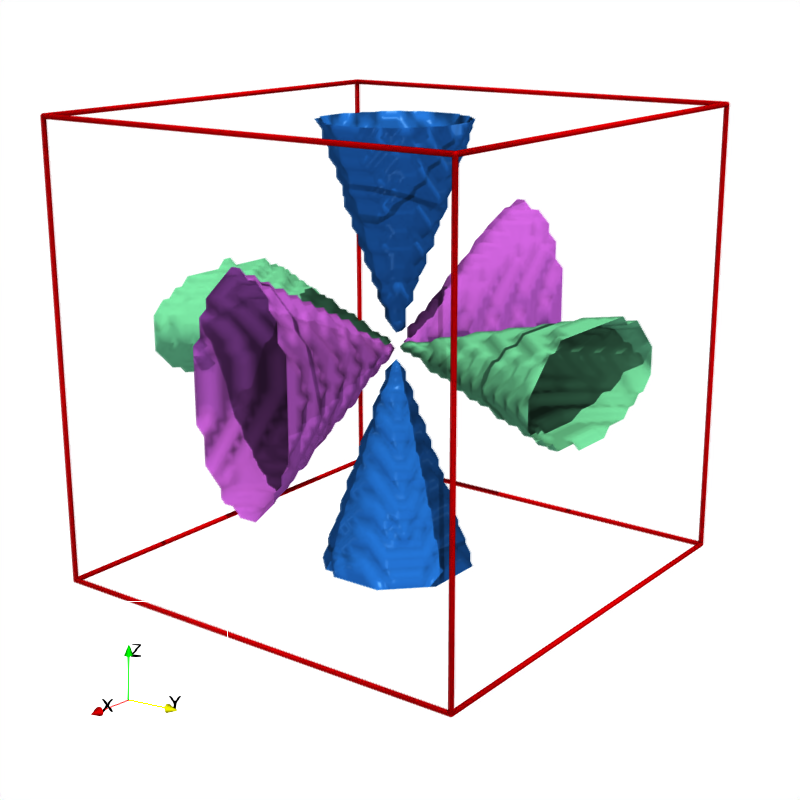

# **Spatial Regions**

## **Geometrically defined regions**

### The `particle_regions` operator

Spatial regions can be very useful in order to define areas in the simulation physical domain that are subsequently used to populate with particles or perform analysis on a subdomain for example. One or multiple named regions can be defined using the `particle_regions` YAML block:

```yaml
particle_regions:
  - REG1: { ... }
  - REG2: { ... }
  - REG3: { ... }
```

Each region can combine, in any subset, an `id_range`, a `bounds` box and a `quadric` shape (see below); a point is inside the region only if it satisfies all of the criteria that were set.

!!! warning

    All regions are defined in the physical space, not in the grid space. This is to be taken into account when creating regions, especially when dealing with triclinic physical domains.

!!! warning "Regions are not periodic"

    Region membership (`bounds` and `quadric`) is a plain geometric test against a particle's raw position — it has no awareness of the domain's `periodic` boundary conditions. A region that is meant to straddle a periodic boundary will **not** wrap around: it is simply cut off at the domain's edge, and particles on the other side of that boundary are excluded even if they'd be adjacent under periodicity. If you need a region that spans a periodic edge, define it as the union (`or`) of the two pieces on either side instead.

Every quadric-based region below — no matter which `shape` keyword it uses, or a raw `matrix` — is really just one symmetric 4×4 matrix $Q$ tested against the point's position. The full equation is optional reading, collapsed here for reference.

??? note "The quadric equation behind every quadric-based region"

    A point $\mathbf{r}=(x,y,z)$ is inside a quadric region if, in homogeneous coordinates $\mathbf{r_h}=(x,y,z,1)$, it satisfies:

    $$
    \mathbf{r_h}^T Q \, \mathbf{r_h} \le 0
    $$

    where $Q$ is a symmetric 4×4 matrix — exactly the 16 coefficients you can provide directly via `quadric.matrix`. Expanded, this is the general quadric surface equation:

    $$
    Q_{11}x^2 + Q_{22}y^2 + Q_{33}z^2 + 2Q_{12}xy + 2Q_{13}xz + 2Q_{23}yz + 2Q_{14}x + 2Q_{24}y + 2Q_{34}z + Q_{44} \le 0
    $$

    Each named `shape` keyword is just a canonical, pre-built choice of $Q$:

    - `sphere`: $Q = \mathrm{diag}(1,1,1,-1)$ → $x^2+y^2+z^2 \le 1$ (unit sphere)
    - `cylx`/`cyly`/`cylz`: same, but the diagonal term for the cylinder's own axis is zeroed instead of squared — e.g. `cylx`: $Q=\mathrm{diag}(0,1,1,-1)$ → $y^2+z^2 \le 1$ (infinite unit cylinder along x)
    - `conex`/`coney`/`conez`: same idea, with that axis' diagonal term negated and $Q_{44}=0$ — e.g. `conex`: $Q=\mathrm{diag}(-1,1,1,0)$ → $y^2+z^2 \le x^2$ (double cone along x)
    - `planex`/`planey`/`planez`, or `plane: [Nx,Ny,Nz,D]`: only the terms coupling $x,y,z$ to the homogeneous `1` are non-zero, giving back the ordinary plane equation $N_x x + N_y y + N_z z + D \le 0$

    `transform`'s `scale`/`translate`/`xrot`/`yrot`/`zrot` operations don't move the point — they instead conjugate $Q$ by the transform's own matrix $T$: $Q' = (T^{-1})^T \, Q \, T^{-1}$. This is exactly what lets a single canonical unit shape be scaled, rotated and translated into place instead of needing a different $Q$ for every size/position. Providing `quadric.matrix` directly skips the canonical-shape step and lets you specify $Q$'s 16 coefficients yourself — `transform` still applies on top of it the same way.

### Individual regions

#### Parallelepiped

```yaml
particle_regions:
  - B1:
      bounds: [ [ 10, 10, 5], [30, 50, 15] ]
  - B2:
      bounds: [ [ 15, 10, 25], [65,30,40] ]
  - B3:
      bounds: [ [ 30, 70, 10], [50, 90, 95] ]
```

<figure markdown="span">
  { width="400" }
</figure>

#### Plane-quadrics

```yaml
particle_regions:
  - P1:
      quadric:
        shape: { plane: [ 1, 0, 0, 0 ] }
        transform: { translate: [ 20, 0, 0 ] }
  - P2:
      quadric:
        shape: { plane: [ 0, 1, 0, 0 ] }
        transform: { translate: [ 0, 20, 0 ] }
  - P3:
      quadric:
        shape: { plane: [ 0, 0, 1, 0 ] }
        transform: { translate: [ 0, 0, 20 ] }
```

<figure markdown="span">
  { width="400" }
</figure>

#### Cylinder-quadrics

```yaml
particle_regions:
  - P1:
      quadric:
        shape: cylx
        transform:
          - scale: [ -1, 15, 15 ]
          - zrot: pi/4.
          - translate: [ 50, 50, 50 ]
  - P2:
      quadric:
        shape: cyly
        transform:
          - scale: [ 15, -1, 15 ]
          - zrot: pi/4.
          - translate: [ 50, 50, 50 ]
  - P3:
      quadric:
        shape: cylz
        transform:
          - scale: [ 15, 15, -1 ]
          - yrot: -pi/4.
          - translate: [ 50, 50, 50 ]
```

<figure markdown="span">
  { width="400" }
</figure>

#### Ellipsoid-quadrics

```yaml
particle_regions:
  - S1:
      quadric:
        shape: sphere
        transform:
          - scale: [ 20, 20, 20 ]
          - translate: [ 45, 75, 70 ]
  - S2:
      quadric:
        shape: sphere
        transform:
          - scale: [ 40, 30, 10 ]
          - translate: [ 50, 60, 20 ]
  - S3:
      quadric:
        shape: sphere
        transform:
          - scale: [ 50, 10, 10 ]
          - yrot: pi/6.
          - translate: [ 50, 30, 50 ]
```

<figure markdown="span">
  { width="400" }
</figure>

#### Cone-quadric

```yaml
particle_regions:
  - CO1:
      quadric:
        shape: conex
        transform:
          - scale: [ 3, 0.75, 1.5 ]
          - translate: [ 50, 50, 50 ]
  - CO2:
      quadric:
        shape: coney
        transform:
          - scale: [ 1.5, 3, 0.75 ]
          - translate: [ 50, 50, 50 ]
  - CO3:
      quadric:
        shape: conez
        transform:
          - scale: [ 1, 1, 3 ]
          - translate: [ 50, 50, 50 ]
```

<figure markdown="span">
  { width="400" }
</figure>

!!! note "Combining several transforms"

    `transform` accepts either a single map (one operation) or a sequence of maps, applied in listed order — the example above applies `scale`, then `zrot`/`yrot`, then `translate`. Available operations are `scale: [sx,sy,sz]`, `translate: [tx,ty,tz]`, `xrot`/`yrot`/`zrot: <angle>` (rotation around that axis) and `plane: [Nx,Ny,Nz,D]`.

```yaml
particle_regions:
  - CYL9:
      quadric:
        shape: cylz
        transform:
          - scale: [ 15 ang, 15 ang, 15 ang ]
          - xrot: pi/4
          - yrot: pi/3
          - zrot: pi/6
          - translate: [ 85 ang, 85 ang, 0 ang ]
```

#### Providing the raw quadric matrix directly

Instead of a named `shape`, `quadric` also accepts a `matrix` key: the 16 row-major coefficients of the quadric's symmetric 4×4 matrix $Q$, evaluated as $\mathbf{r}^T Q \mathbf{r} \le 0$ with $\mathbf{r} = (x,y,z,1)$. `matrix` and `shape` are mutually exclusive — exactly one of the two must be given — but `transform` still applies on top of either.

The example below spells out the same unit-sphere quadric that `shape: sphere` produces internally, transformed exactly like the `S1` region in [Ellipsoid-quadrics](#ellipsoid-quadrics) above:

```yaml
particle_regions:
  - S4:
      quadric:
        matrix: [ 1, 0, 0, 0,
                  0, 1, 0, 0,
                  0, 0, 1, 0,
                  0, 0, 0, -1 ]
        transform:
          - scale: [ 20, 20, 20 ]
          - translate: [ 45, 75, 70 ]
```

Use `matrix` directly when you need a quadric shape that isn't one of the named `shape` keywords — e.g. a general ellipsoid or hyperboloid expressed by its own coefficients — rather than one of `sphere`/`conex`/`cylz`/etc.

#### Range of particle ids

`id_range: [start, end]` selects particles whose id `i` satisfies `start <= i < end` (the upper bound is exclusive):

```yaml
particle_regions:
  - REGID1:
      id_range: [1, 1300]
```

## **Grid mask defined regions**

Besides the geometric shapes above, a region can also be defined by a discretized per-(sub)cell scalar field on the grid — a **mask**. Particle-generation operators (`lattice`, `bulk_lattice`) can be restricted to only the (sub)cells whose mask value matches a given value, via `grid_cell_values`/`grid_cell_mask_name`/`grid_cell_mask_value`.

### Building the mask

Two operators can produce this field:

- `set_cell_values`: writes a value to grid (sub)cells that fall inside a geometric region — the same shapes/expressions as above.

    ```yaml
    particle_regions:
      - CYLX:
          quadric:
            shape: cylx
            transform:
              - scale: [ 15, 15, 15 ]
              - translate: [ 50, 50, 50 ]

    set_cell_values:
      field_name: "MASK1"
      region: CYLX
      value: [1]
      grid_subdiv: 10
    ```

    !!! note

        `value` is a list, one entry per field component (`ncomps = value.size()`) — every component is written together for each (sub)cell inside `region`. For a plain mask, use a **single-element** list like `[1]`: a field used later as `grid_cell_mask_name` must have exactly one component (`subdiv³` values per cell, not `subdiv³ × ncomps`), otherwise the mask consumer fails with "expected a scalar value field for cell mask". (Sub)cells outside `region` are left at the field's default value (`0`).

- `read_cell_values`: reads a scalar field from an external structured-grid `.vtk` file into the same kind of per-cell field — e.g. a mask computed by an external tool, rather than one of the shapes above.

    ```yaml
    read_cell_values:
      field_name: "MASK1"
      file_name: "points_40x40x40.vtk"
      grid_subdiv: 4
      grid_ordering: F_ORDER
    ```

### Using the mask to restrict particle generation

`lattice`/`bulk_lattice` accept `grid_cell_mask_name` (the field built above) and `grid_cell_mask_value`. A particle is only generated in a (sub)cell whose mask value is **exactly equal** to `grid_cell_mask_value` — this is a strict equality test, not a greater-than/less-than threshold, despite the name:

```yaml
lattice:
  structure: BCC
  types: [ W, W ]
  size: [ 3 ang, 3 ang, 3 ang ]
  grid_cell_mask_name: MASK1
  grid_cell_mask_value: 1
```

A geometric `region`, a grid mask, and a [`user_function`](#user-defined-source-term) can all be combined on the same particle-generation operator: a particle is generated only if every criterion that was given agrees.

## **Combining regions**

`particle_regions` only defines named geometric regions; operators that consume a region (`track_region_particles`, `set_cell_values`, …) take a `region`/`expr` string that combines those names with the boolean operators `and`, `or`, `not` and parentheses, e.g. `"PLANE1 and (SPHERE1 or not BOX1)"`.

## **User-defined source term**

Particle-generation operators (e.g. `bulk_lattice`) accept a `user_function`/`user_threshold` pair to further restrict where particles are generated: particles are only placed where the scalar function evaluates to a value greater than or equal to `user_threshold`.

```yaml
bulk_lattice:
  # ... lattice parameters ...
  user_function:
    wavefront:
      # first 3 values are interface plane (Pi)'s normal vector (X,Y,Z), last one is plane offset (position of origin relative to the plane).
      plane: [ -1, 0, 0, 125.0 ang ]
      # wave plane (normal and offset). Oriented distance to the plane, Pw(r), is used to add a sinusoid function sin(Pw(r))*amplitude to the plane function above
      wave: [ 0, 0.1, 0, 0 ]
      amplitude: 10.0 ang
  user_threshold: 0.0
```

```yaml
bulk_lattice:
  # ... lattice parameters ...
  user_function:
    sphere:
      center: [30, 30, 30]
      amplitude: 10.
      radius_mean: 20.
      radius_dev: 2.
      time_mean: 0.
      time_dev: 1.
```

```yaml
bulk_lattice:
  # ... lattice parameters ...
  user_function:
    constant: 10.
```

## **Regions-related operations**

### Tracking particles inside a region

`track_region_particles` reassigns particle IDs so that every particle inside the given region gets a contiguous block of IDs starting at 0, and every other particle gets IDs immediately after that block (contiguous across MPI ranks via `MPI_Exscan`). The region is then registered into `particle_regions` under `name`, with a fast `id_range`-based membership test for later operators. Only one region can be tracked at a time.

```yaml
track_region_particles:
  expr: PLANE1
  name: "PISTON"
```

### Tracking multiple regions at once

`track_region_particles_multiple` does the same thing for several regions in one pass: each tracked region gets its own contiguous ID block (region 0 first, then region 1, etc.), and particles outside all tracked regions get IDs after the last block. If a particle matches more than one of the given expressions, it's assigned to the first one that matches.

```yaml
# First define regions
particle_regions:
  - BOTTOMBOX:
      bounds: [ [ -200 ang, -200 ang, -200 ang ], [ 200 ang, 200 ang, 15 ang ] ]
  - TOPBOX:
      bounds: [ [ -200 ang, -200 ang, 135 ang ], [ 200 ang, 200 ang, 200 ang ] ]

# Then track them, in one pass
track_region_particles_multiple:
  exprs: [ "BOTTOMBOX", "TOPBOX" ]
  names: [ "BAS", "HAUT" ]
```

!!! warning

    Both operators reassign IDs for **every** particle in the simulation, not just the tracked region(s) — original ID values and ordering are not preserved anywhere, in or out of the tracked region. Use `track_region_particles` for a single region and `track_region_particles_multiple` when tracking more than one at once.

See [Grid mask defined regions](#grid-mask-defined-regions) for `set_cell_values`/`read_cell_values`, which assign or read region-derived values on the grid itself.
