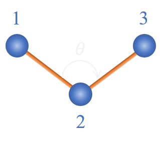

# Bending potentials

A bending type is defined by a triplet of atom types, a functional form and the corresponding parameters values.
The order of the atom types correspond to the numerical order of the figure.

<figure markdown="span">
  { width="200" }
  <figcaption>A bending angle between atoms 1, 2 and 3  </figcaption>
</figure>

The bending angle $\theta$ is defined by:

$$
\theta = \arccos{\frac{\mathbf{r}_{21}\cdot \mathbf{r}_{23}}{r_{21}r_{23}}}
$$

The following types of bending potentials are defined in **exastamp**:

- [**harm_bend**](harm_bend.md)
- [**opls_bend**](opls_bend.md)
- [**quar_bend**](quar_bend.md)
- [**no_potential**](no_potential.md)

