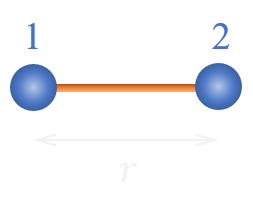

# Bond potentials

A bond type is defined by a pair of two atom types, between which the bond can exist, a functional form and the corresponding parameters values.

<figure markdown="span">
  { width="200" }
  <figcaption>A bond of length r between atoms 1 and 2  </figcaption>
</figure>

The length of a bond is defined as:

$$
r = \lVert \mathbf{r}_2 - \mathbf{r}_1 \lVert
$$

The following functional forms of bond potentials are defined in **exastamp**:

- [**harm_bond**](harm_bond.md)
- [**opls_bond**](opls_bond.md)
- [**quar_bond**](quar_bond.md)
- [**no_potential**](no_potential.md)

