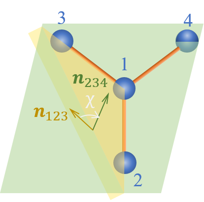

# Improper potentials

An improper torsion type is defined by a quadruplet of atom types, a functional form and the corresponding parameters values.
The order of the atom types in the quadruplet is that of the figure. The first atom in the quadruplet is the central atom.
So far in **exaStamp**, improper torsion angles have only been used to maintain the central atom in the plane defined by the three other atoms. 

<figure markdown="span">
  { width="400" }
  <figcaption>An improper torsion angle between atoms 1, 2, 3 and 4.  </figcaption>
</figure>

The expression of the improper torsion angle $\chi$ is the exact same as that of the "proper" torsion angle, with
atoms 1, 2, 3 and 4 in the order specified above for each torsion type.
It is useful to define first the vectors $\mathbf{V}$ and $\mathbf{W}$:

$$
\mathbf{V} = \frac{\mathbf{r}_{21}\times \mathbf{r}_{23}}{\lVert \mathbf{r}_{21} \lVert \lVert \mathbf{r}_{23} \lVert}
$$

$$
\mathbf{W} = \frac{\mathbf{r}_{34}\times \mathbf{r}_{23}}{\lVert \mathbf{r}_{34} \lVert \lVert \mathbf{r}_{23} \lVert}.
$$

The improper torsion angle $\chi$ is then given by its cosine and sign:

$$
\cos{\chi} = \mathbf{V}\cdot\mathbf{W}
$$

$$
\text{sgn }\chi = \text{sgn} \left ( \mathbf{V}\times\mathbf{W}\cdot\mathbf{r}_{23} \right )
$$

The following types of improper torsion potentials are defined in **exastamp**:

- [**harm_improper**](harm_improper.md)
- [**opls_improper**](opls_improper.md)
- [**no_potential**](no_potential.md)

