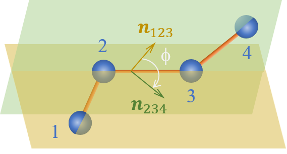

# Torsion potentials

A torsion type is defined by a quadruplet of atom types, a functional form and the corresponding parameters values.
The order of the atom types in the quadruplet is that of the figure.

<figure markdown="span">
  { width="400" }
  <figcaption>A torsion angle between atoms 1, 2, 3 and 4.  </figcaption>
</figure>

To express the torsion angle $\phi$, it is useful to define first the vectors $\mathbf{V}$ and $\mathbf{W}$:

$$
\mathbf{V} = \frac{\mathbf{r}_{21}\times \mathbf{r}_{23}}{\lVert \mathbf{r}_{21} \lVert \lVert \mathbf{r}_{23} \lVert}
$$

$$
\mathbf{W} = \frac{\mathbf{r}_{34}\times \mathbf{r}_{23}}{\lVert \mathbf{r}_{34} \lVert \lVert \mathbf{r}_{23} \lVert}.
$$

The torsion angle $\phi$ is then given by its cosine and sign:

$$
\cos{\phi} = \mathbf{V}\cdot\mathbf{W}
$$

$$
\text{sgn }\phi = \text{sgn} \left ( \mathbf{V}\times\mathbf{W}\cdot\mathbf{r}_{23} \right )
$$

The following types of torsion potentials are defined in **exastamp**:

- [**harm_torsion**](harm_torsion.md)
- [**opls_torsion**](opls_torsion.md)
- [**compass_torsion**](compass_torsion.md)
- [**0.5compass_torsion**](0.5compass_torsion.md)
- [**cos_two**](cos_two.md)
- [**no_potential**](no_potential.md)

