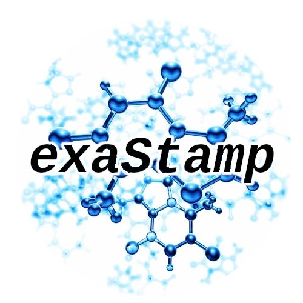

# Welcome to the exaStamp online documentation! { style="color: var(--md-primary-fg-color);" }

  

    

      exascale Simulations of
      Time-dependent Atomistic and
      Molecular systems in Parallel
    

  

  

    
  

!!! info "Information"
    
    Direct access to general information about the code features, GitHub repositories and team information can be found below. To access the documentation related to build and install instruction, user guide, tutorials and so on, please use the top menu.
  

  
-   :material-feature-search-outline:{ .lg .middle } __Features__

    ---

     - Classical Molecular Dynamics
     - Polymers, Molecules, Metals, Ceramics
     - Semi-empirical and ML Potentials
     - High strain rate, Mechanics, Shock loading
     - Massively parallel MPI x OpenMP x GPU

-   :octicons-mark-github-16:{ .lg .middle } __Access to the code__

    ---
  
    - [:material-code-braces: GitHub repository](https://github.com/Collab4exaNBody/exaStamp) to access the code and fork the repository for new developments.
    - [:octicons-issue-opened-16: Open a new issue](https://github.com/Collab4exaNBody/exaStamp/issues) to report bugs.
    - [:octicons-git-pull-request-16: Create a pull request](https://github.com/Collab4exaNBody/exaStamp/pulls) to ask for your developments to be merged.
  
-   :simple-semanticrelease:{ .lg .middle } __Latest Releases__

    ---
    - :octicons-tag-24: [__V3.8.0__](https://github.com/Collab4exaNBody/exaStamp/releases/tag/v3.8.0)

    - :octicons-tag-24: [__V3.7.5__](https://github.com/Collab4exaNBody/exaStamp/releases/tag/v3.7.5)

    - :octicons-tag-24: [__V3.7.4__](https://github.com/Collab4exaNBody/exaStamp/releases/tag/v3.7.4)
    
-   :material-scale-balance:{ .lg .middle } __Open Source, Apache 2.0__

    ---

    exaStamp is the result of a long-time and collaborative effort at CEA, France. It is an open-source code, distributed under the terms of the Apache Public License version 2.0.

    [:octicons-arrow-right-24: License](About/img/LICENSE)

-   :fontawesome-solid-people-carry:{ .lg .middle } __Team__

    ---

    Core team:

    - Paul Lafourcade, CEA DAM DIF -  [:octicons-mark-github-16:](https://github.com/lafourcadep) [:fontawesome-brands-google-scholar:](https://scholar.google.com/citations?user=UVKEf6cAAAAJ&hl=en)
    - Thierry Carrard, CEA DAM DIF - [:octicons-mark-github-16:](https://github.com/carrardt) [:fontawesome-brands-google-scholar:](https://scholar.google.com/citations?user=2kMei3YAAAAJ&hl=en&oi=ao)
    - Raphaël Prat, CEA DES -  [:octicons-mark-github-16:](https://github.com/rprat-pro) [:fontawesome-brands-google-scholar:](https://scholar.google.com/citations?user=krjPnoAAAAAJ&hl=en&oi=ao)

    [:octicons-arrow-right-24: Meet the full team](About/index.md#contributors)
  
-   :fontawesome-solid-contact-book:{ .lg .middle} __Contact__

    ---

    Use the [:octicons-discussion-closed-16: Github discussions](https://github.com/Collab4exaNBody/exaStamp/discussions) to suggest new features, discuss ideas, check announcements or show what you're doing with the code.
    
    See the [About](About/index.md) page for contact and license information.
  

